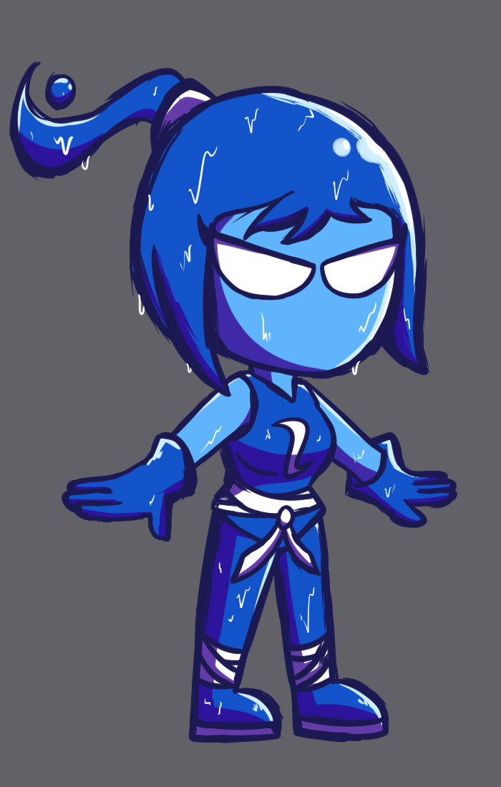
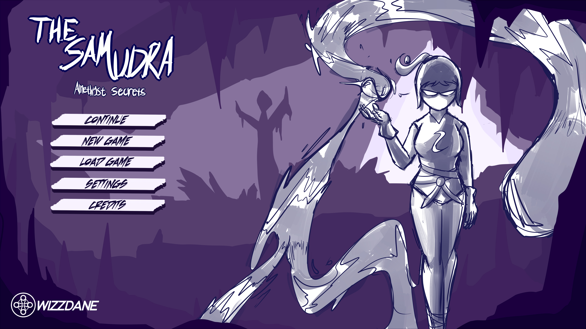

Samudra

A 2D Platformer Side-Scroller
This project is a 2D platformer side-scroller game called "Samudra," developed as a fun school project. While we didn't get to finish the game completely due to our school commitments, we're proud of the work we accomplished and are calling it "done" for now. This repository stands as a tribute to our team's effort and a great learning experience.

---------------

Project Status: The project is not fully complete.

This game was a passion project that we worked on during our free time. We've decided to mark the project as "done" to reflect the point at which our team concluded its development. The current version represents our progress and what we were able to build together.

----------------

Technologies Used
Game Engine: Unity

Programming Language: C#

Art Assets: Photoshop, Aseprite, Blender

Other Tools: Visual Studio Code, Git

-----------

Meet the Team

Hadi  - Project Lead and programmer

Zahran - Programmer

Wijdan - Art Lead

Izdihar - Art and design

------------

Screenshots

--------------

License
This project is licensed under the MIT License.
